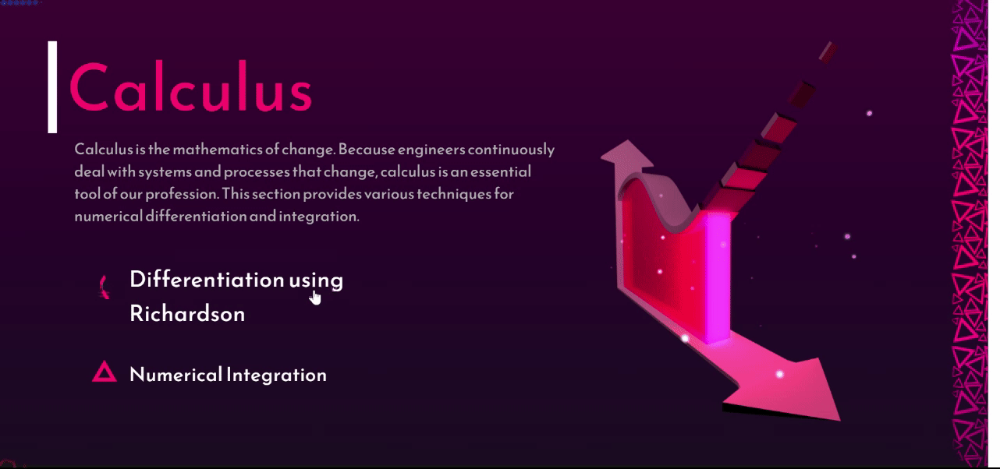
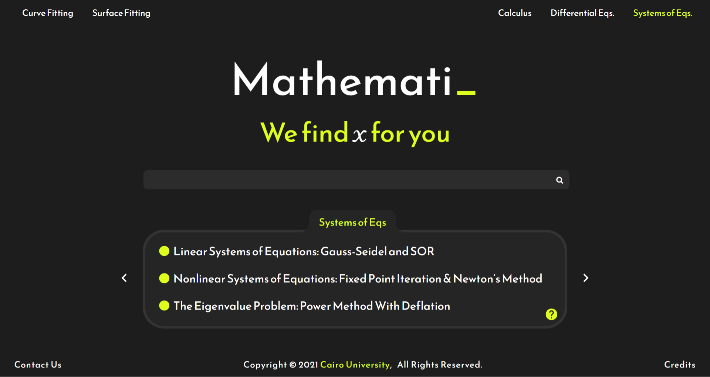
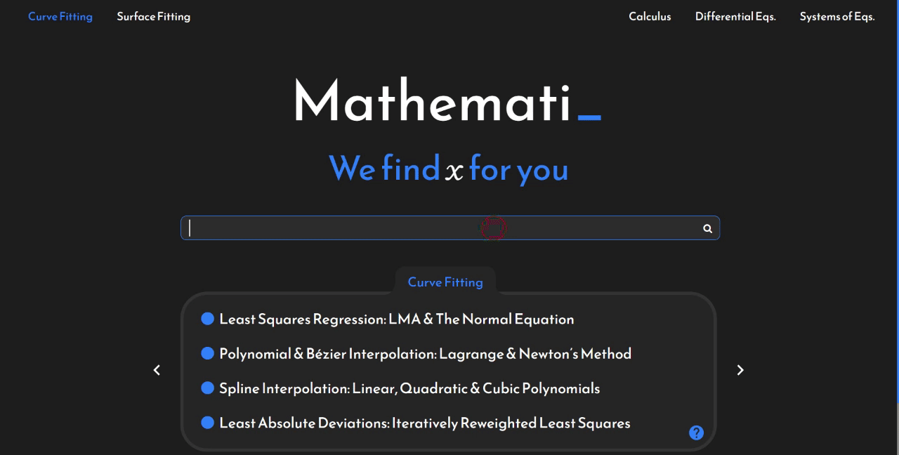
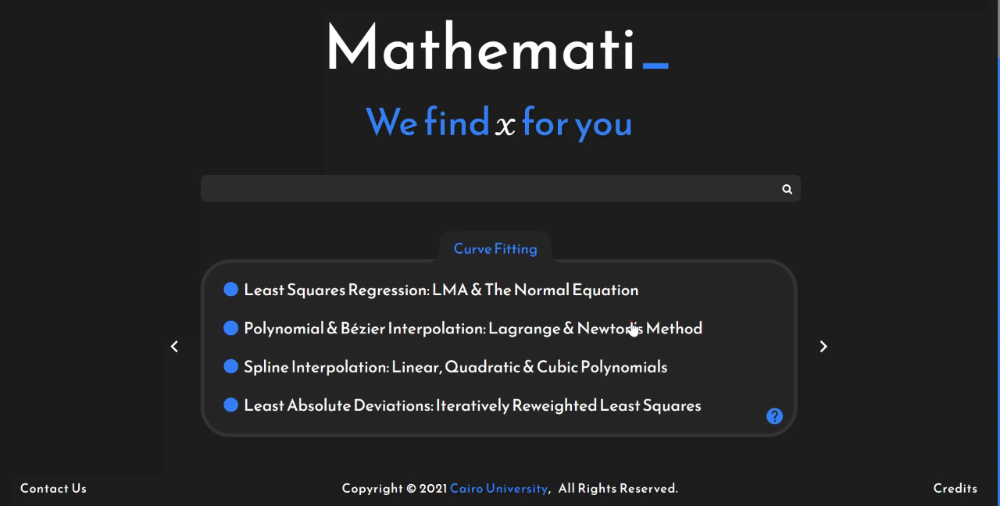
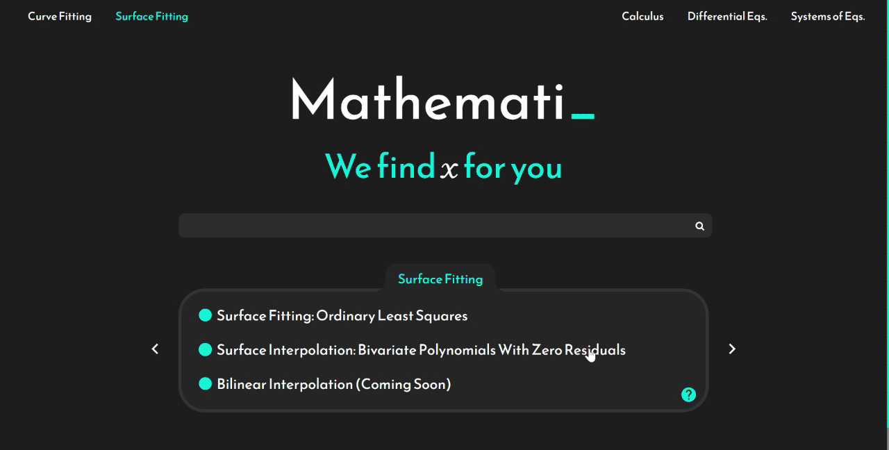
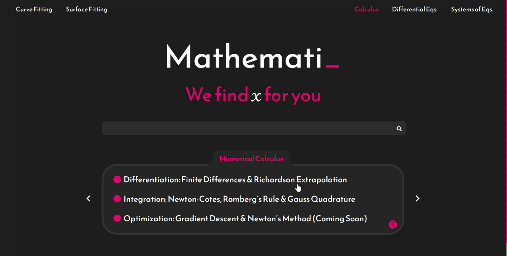
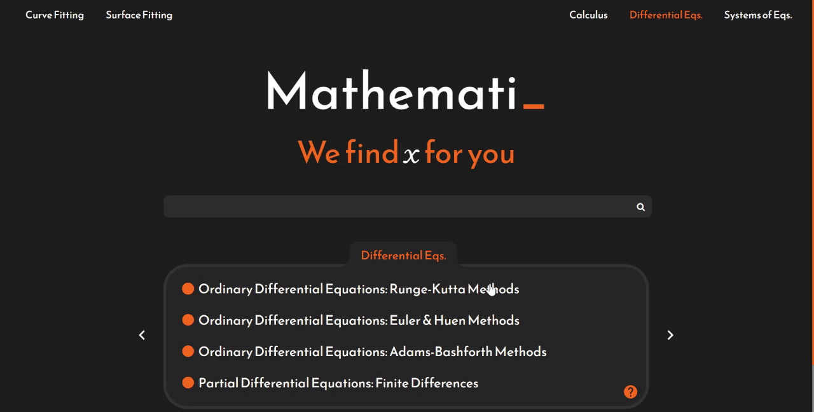
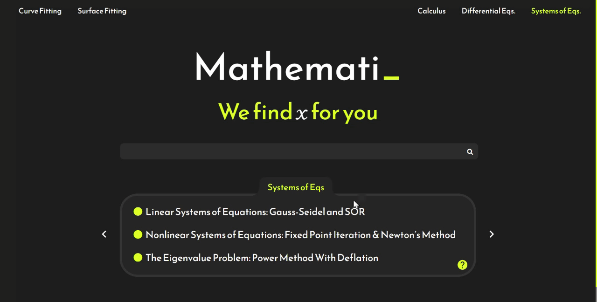
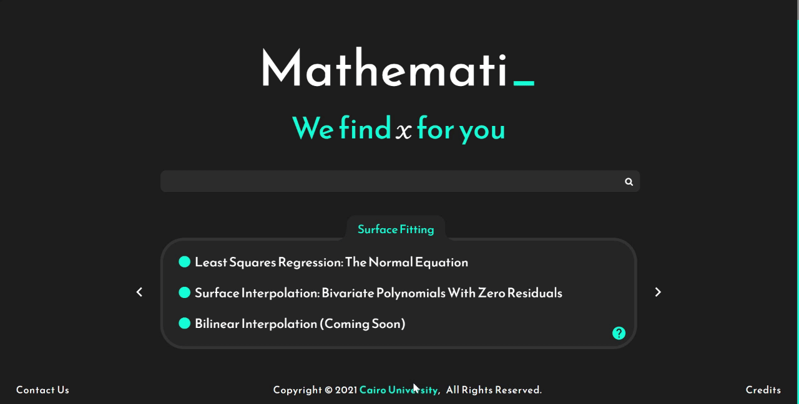

  
  # 

  <b>Mathemati</b> is a website created with love by Cairo University's freshmen (graduating 2023) that features over <b>24 different numerical methods</b> that tackle different problems in mathematics, ranging from complicated problems like PDEs and ODEs that lack a closed form to other problems that you won't find elsewhere on the internet, such as Least Absolute Errors & Surface Interpolation, besides problems that can situationally get complicated such as non-linear systems and triple integrals. For the time being, you can visit the website at
  

http://Mathematinu.com/

 

🎨 <b>In case you're here to contribute,</b>
All it takes is to run app.py after cloning the project in order to get going. Feel free to contact us.
 
 
 

   <h2> Technologies used </h2>
  
   
  

  

  <h2> 🛫 <b>  Now it's time for a free tour </b> 🛬 </h2>
  
  <h3> Legacy Homepage </h3> 
  <a href="https://www.behance.net/gallery/94692789/MatheMati">UI Designs on Behance</a>
       
  
    

     
Each slide here involves an animation for each method, like this:     
  

  

     
Of course due to your internet, we'll get to Mars before you load the homepage, that's why the following is what we have for you instead
     
  

  
<h3>Homepage </h3>

  

     
You can navigate through different pages using your mouse or keyboard, the five general topics are <b> Curve Fitting, Surface Fitting, Calculus, Differential Equations and System of Equations. </b>     
  

  
  

  
    In order to find the method you want to use in O(1), it also comes with a <b>search feature.</b>
   
  

 
  

  
   True fans will be able to rediscover Mathemati in order to land on the <b> legacy homepage</b>, as a hint:
   
  

   
  

  
Now let's appraise one of the methods included in each of the topics
     
  

  <h3>Curve Fitting: Interpolation</h3>

  
  <h3>Surface Fitting: Surface Interpolation</h3>

  
  <h3>Calculus: Differentiation</h3>

  
   <h3>Differential Equations: Runge-Kutta Methods</h3>

  
 <h3>Systems of Eqs: Linear Systems</h3>

  
  

  
Most pages also come with a video to guide you on how to use it.
   
  

   
  
 
They also usually include a small document explaining how the method itself works/how it was implemented (the next icon down.)
   

   <h3>Credits</h3>

 
   <h3>Thank you :))</h3>

  

  
    <b>Final note:</b> Please beware that some methods in the website demand that you use Python's syntax for mathematical expressions, not all methods support exponentiation through (a^b) insead of (a**b) and you should write (x*y) instead of (xy).
   
  

  

 

